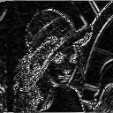

# FPGA 2D filter

This FPGA-based image filter can filter a provided image through several methods.

Each of these filters have been tested on the standard test image [Lenna](https://en.wikipedia.org/wiki/Lenna).


## Implemented filters

### Averaging
Each pixel (except the top and bottom ones) is replaced by the average of all its surrounding pixels.


### Vertical contour detection filter
This filter applies factors from the following matrix, in order to detect vertical countours:
```
__         __
| -1   0  +1 |
| -2   0  +2 |
| -1   0  +1 |
‾‾         ‾‾
```


### Horizontal contour detection filter
This filter applies factors from the following matrix, in order to detect horizontal countours:
```
__         __
| -1  -2  -1 |
|  0   0   0 |
| +1  +2  +1 |
‾‾         ‾‾
```



### Full contour detection filter
This filter applies factors from the following matrix, in order to detect all countours:
```
__         __
|  0  -1   0 |
| -1   4  -1 |
|  0  -1   0 |
‾‾         ‾‾
```


## Implementing new filters

This software has been designed with modularity in mind, up to a certain point.

That means you can straightforwardly add new filter matrixes to `filter.vhd`, or replace some existing ones.

## Testing

To test the filters, you can use the test bench (`tb_filter.vhd`) as a Vivado simulation source.

In that file, depending on the filtering method you want to test, you should uncomment the relevant value for `filter_type_to_test` and comment out the others.

In `fpga-2d-filter.sim/sim_1/behav/xsim`, you should provide an `input.dat` file containing each pixel, line by line, in binary format.

The test bench will output the filtered image, in that same directory, into `output.dat`.

You may convert this input data to a bitmap image, manually, by running `dat2bmp.m` with GNU Octave. This will create `output.bmp` at the root of the project!

## ___________________
This software has been designed by [Firmin Launay](mailto:Firmin_Launay@etu.u-bourgogne.fr), in 2024, as part of the Reconfigurable Architectures course at Polytech Dijon.
